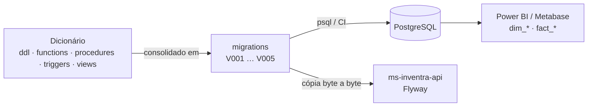
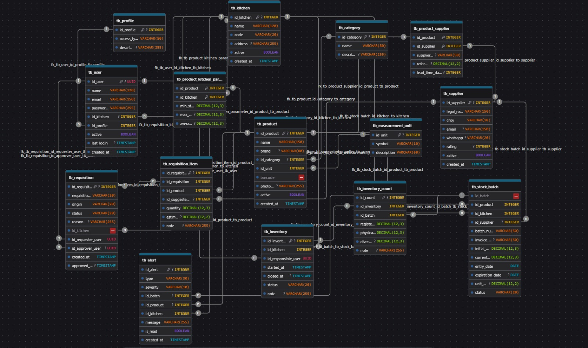

<div align="center">

# 📦 Inventra Database

**Schema PostgreSQL do Inventra: gestão de estoque para cozinhas industriais.**


[](https://github.com/InventraTech/inventra-database/actions/workflows/migrations.yml)


</div>

Banco de dados do projeto interdisciplinar **Inventra**. Este repositório é a **fonte da verdade do schema**: tabelas, regras de negócio em SQL, auditoria automática, camada de consulta e Data Mart para BI. A API (`ms-inventra-api`) consome as migrations daqui.

## Sumário

- [Visão geral](#visão-geral)
- [Arquitetura](#arquitetura)
- [Quick start](#quick-start)
- [Modelo de dados](#modelo-de-dados)
- [Documentação](#documentação)
- [Estrutura do repositório](#estrutura-do-repositório)
- [Desenvolvimento](#desenvolvimento)
- [Roadmap](#roadmap)
- [Contribuidores](#contribuidores)

## Visão geral

| | |
|---|---|
| **Domínio** | Lotes de estoque, requisições, inventário, fornecedores e alertas de vencimento |
| **Modelo** | 15 tabelas de negócio + 7 tabelas de log (herdam de `tb_log_base`) |
| **Regras no banco** | 6 functions + 7 procedures + 6 triggers de negócio |
| **Auditoria** | Trigger `AFTER INSERT/UPDATE/DELETE` grava antes/depois (JSON) em 7 tabelas `tb_log_*` |
| **Consulta** | 15+ views operacionais, 3 views analíticas (CTE + Window Functions), star schema virtual (4 `dim_*`, 3 `fact_*`) |
| **Entrega** | Migrations idempotentes `V001`–`V005`, com rollback e validação no CI |

## Arquitetura

O projeto separa o **dicionário** (código de leitura, um arquivo por assunto) da **esteira de migrations** (o que de fato roda no banco, com guardas de idempotência).



| Migration | Conteúdo |
|-----------|----------|
| `V001__init_database.sql` | Tabelas, FKs, índices e checks |
| `V002__business_rules.sql` | Functions, procedures e triggers de negócio |
| `V003__audit_logs.sql` | Tabelas, índices, functions e triggers de log |
| `V004__views.sql` | Views operacionais + Data Mart |
| `V005__etl_analytics.sql` | Views analíticas (CTEs + Window Functions) |

Detalhes, convenções e decisões de design em [`docs/ARCHITECTURE.md`](postgre/docs/ARCHITECTURE.md).

## Quick start

**Requisitos:** PostgreSQL 14+ e `psql` (testado no CI com PostgreSQL 16).

```bash
git clone https://github.com/InventraTech/inventra-database.git
cd inventra-database/postgre

for f in migrations/V*.sql; do
  psql -v ON_ERROR_STOP=1 --single-transaction -U usuario -d inventra_db -f "$f"
done
```

As migrations são idempotentes: reexecutar em um banco que já as recebeu não gera erro.

**Rollback completo:**

```bash
psql -v ON_ERROR_STOP=1 --single-transaction -U usuario -d inventra_db -f migrations/rollback/drop_everything.sql
```

Para reverter apenas uma camada, use o `rollback/` da respectiva pasta de dicionário (ex: `ddl/tables/rollback/drop_tables.sql`).

**Massa de dados fictícia (opcional):**

```bash
cp ../.env.example ../.env          # ajuste as credenciais
pip install -r seeds/requirements.txt
jupyter notebook seeds/seed.ipynb
```

## Modelo de dados



| Grupo | Tabelas |
|-------|---------|
| **Cadastros base** | `tb_user`, `tb_profile`, `tb_kitchen`, `tb_product`, `tb_category`, `tb_measurement_unit`, `tb_supplier` |
| **Relacionamentos** | `tb_product_supplier`, `tb_product_kitchen_parameter` |
| **Movimentações** | `tb_stock_batch`, `tb_requisition`, `tb_requisition_item`, `tb_inventory`, `tb_inventory_count` |
| **Eventos** | `tb_alert` |
| **Auditoria** | `tb_log_base` + `tb_log_user`, `tb_log_product`, `tb_log_supplier`, `tb_log_stock_batch`, `tb_log_requisition`, `tb_log_inventory`, `tb_log_alert` |

Outras versões do modelo (V1, V2 e auditoria) estão em [`docs/modeling`](postgre/docs/modeling).

## Documentação

| Documento | Assunto |
|-----------|---------|
| [`ARCHITECTURE.md`](postgre/docs/ARCHITECTURE.md) | Dicionário vs. migrations, convenções, CI, herança das tabelas de log |
| [`BUSINESS_RULES.md`](postgre/docs/BUSINESS_RULES.md) | Functions, procedures, triggers de negócio e de auditoria |
| [`VIEWS_AND_DATAMART.md`](postgre/docs/VIEWS_AND_DATAMART.md) | Views operacionais, star schema e views analíticas |
| [`EXPLAIN_ANALYZE.md`](postgre/docs/query_optimization/EXPLAIN_ANALYZE.md) | Otimização de consultas: planos antes/depois dos 4 índices criados |
| [`inventra_erp_flow.html`](postgre/docs/inventra_erp_flow.html) | Diagrama de fluxo ERP |

## Estrutura do repositório

```text
postgre/
├── ddl/             # tables, constraints, indexes e logs
├── functions/       # funções de negócio e de log
├── procedures/      # rotinas chamadas via CALL
├── triggers/        # gatilhos de negócio e de auditoria
├── views/           # vw_*  ·  datamart/ (dim_*, fact_*)  ·  analytics/
│                    #   (cada pasta tem subpasta rollback/)
├── migrations/      # V001–V005 + rollback/drop_everything.sql
├── seeds/           # seed.ipynb + requirements.txt
├── tests/           # check_migrations.sh (idempotência + rollback)
└── docs/            # arquitetura, regras, views, modelagem, otimização
.github/workflows/   # CI das migrations
.env.example         # variáveis de conexão usadas pelo seed
```

## Desenvolvimento

1. A mudança nasce na pasta de dicionário correspondente **e** em uma **nova** migration (`V006`, `V007`…). Migration já aplicada não se edita.
2. Valide localmente com o mesmo script do CI:

   ```bash
   PGHOST=localhost PGUSER=postgres PGPASSWORD=postgres PGDATABASE=inventra_db \
     bash postgre/tests/check_migrations.sh
   ```

   Ele aplica as migrations, reaplica (idempotência), faz rollback completo e reaplica do zero.
3. O CI roda esse mesmo script em cada push/PR que toque `postgre/`.
4. A API copia `V001`+ byte a byte para o Flyway; nunca edite migration direto lá.

> `RAISE EXCEPTION` das functions e procedures fica em português de propósito: a API repassa a mensagem ao cliente nas respostas 409.

## Roadmap

- [x] Functions, procedures e triggers de negócio
- [x] Auditoria com herança de tabelas de log
- [x] Views operacionais, Data Mart e views analíticas
- [x] Seed inicial (`seeds/seed.ipynb`)
- [x] Teste automatizado de idempotência/rollback no CI
- [ ] Testes de integridade e performance
- [ ] Dicionário de dados (Data Dictionary `.md`)
- [ ] Ambiente de homologação

## Contribuidores

| Nome | Papel |
|------|-------|
| **@dvarakaki** | Desenvolvedor de Banco de Dados |
| **@joohnyxxz** | Desenvolvedor de Banco de Dados |

## Licença

[MIT](LICENSE) · Organização: [InventraTech](https://github.com/InventraTech)
