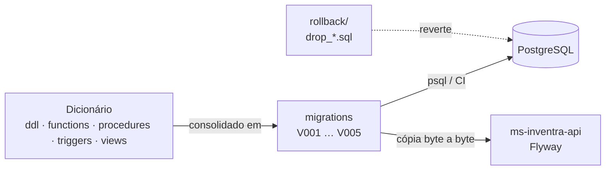
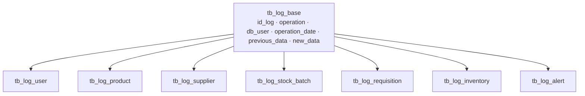

# Arquitetura do Banco

Visão de como o repositório é organizado e por que, mais as decisões de design que não cabem no README.

## Dicionário vs. Esteira de Migrations

| Camada | Pastas | Papel |
|--------|--------|-------|
| **Dicionário** | `ddl/`, `functions/`, `procedures/`, `triggers/`, `views/` | Fonte para leitura e consulta de desenvolvedores. Código estrito (`CREATE TABLE`, `CREATE VIEW`), um arquivo por assunto. |
| **Rollback** | subpasta `rollback/` de cada pasta acima | Scripts isolados de destruição (`DROP ... CASCADE`), separados de propósito para não serem executados por engano. |
| **Esteira** | `migrations/` | O que realmente roda no banco. Consolida o dicionário com guardas de idempotência (`IF NOT EXISTS`, `OR REPLACE`). |

## Migrations

| Versão | Conteúdo |
|--------|----------|
| `V001__init_database.sql` | Tabelas, FKs, índices e checks |
| `V002__business_rules.sql` | Functions, procedures e triggers de negócio |
| `V003__audit_logs.sql` | Tabelas, índices, functions e triggers de log |
| `V004__views.sql` | Views operacionais (`vw_*`) e Data Mart (`dim_*` / `fact_*`) |
| `V005__etl_analytics.sql` | Views analíticas com CTEs e Window Functions |
| `rollback/drop_everything.sql` | Reversão completa |

As pastas de dicionário não têm numeração porque não representam sequência; a ordem de execução é definida só por `migrations/`.

## Convenções

- **Fonte da verdade:** este repositório é o dono do schema. Toda mudança nasce aqui, na pasta de dicionário correspondente **e** em `migrations`.
- **Integração com a API:** `ms-inventra-api` apenas copia `V001` a `V005` byte a byte para `src/main/resources/db/migration` e o Flyway aplica. Nunca se edita migration direto na API.
- **Imutabilidade:** migrations são idempotentes e numeradas em sequência (`V006`, `V007`…). Uma migration já aplicada em algum banco não deve ser alterada; mudanças novas entram em uma nova versão.
- **Mensagens em português:** os `RAISE EXCEPTION` das functions e procedures estão em português de propósito, porque a API os repassa ao cliente no `detail` das respostas 409.
- **Job diário:** `sp_expire_batches()` marca lotes vencidos como `EXPIRED` e gera os alertas correspondentes. É chamada diariamente pelo `BatchExpirationJob` da API.

## Validação automática (CI)

`tests/check_migrations.sh` roda no GitHub Actions (`.github/workflows/migrations.yml`, PostgreSQL 16) e cobre quatro passos:

1. aplica `V001`…`V005` em banco limpo;
2. reaplica tudo (prova de idempotência);
3. executa `rollback/drop_everything.sql`;
4. reaplica do zero após o rollback.

## Herança de tabela nas tabelas de log

As 7 tabelas de log (`tb_log_user`, `tb_log_product`, `tb_log_supplier`, `tb_log_stock_batch`, `tb_log_requisition`, `tb_log_inventory`, `tb_log_alert`) usam **herança de tabela** (`INHERITS`) a partir de `tb_log_base`, que concentra as colunas comuns de auditoria (`id_log`, `operation`, `db_user`, `operation_date`, `previous_data`, `new_data`). Cada filha soma só a coluna que identifica a entidade auditada (ex: `id_product` em `tb_log_product`).

**Por que herança e não CTE recursiva:** as duas técnicas resolvem problemas diferentes. CTE recursiva serve para navegar uma relação hierárquica *dentro da mesma tabela*, onde uma linha referencia outra linha da própria tabela (ex: categoria com subcategoria, organograma). As tabelas de log não são hierárquicas: são 7 entidades **irmãs**, sem relação de pai/filho entre si, que só compartilham o mesmo formato de colunas de auditoria. Isso é exatamente o que herança resolve: reaproveitar uma estrutura comum sem duplicar colunas, mantendo a consulta consolidada via `SELECT * FROM tb_log_base`, que já retorna as linhas de todas as filhas.

**Verificação:** `INSERT`/`UPDATE`/`DELETE` numa tabela principal (ex: `tb_product`) dispara a trigger de auditoria, que grava na filha correspondente (`tb_log_product`). A linha aparece tanto na consulta pela filha quanto pela base (`tb_log_base`), sem `UNION` manual.
