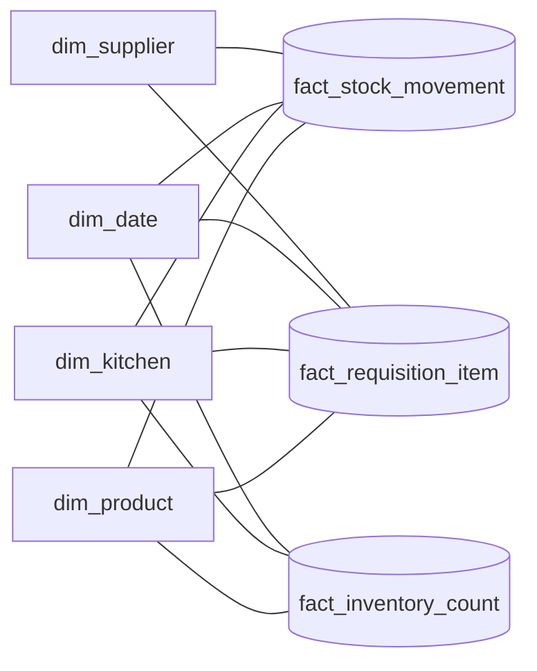

# Views, Data Mart e Analytics

Camada de consulta do banco, criada em `migrations/V004__views.sql` e `migrations/V005__etl_analytics.sql`.

## Views operacionais (`vw_*`)

Arquivo: `views/create_views.sql`. Dão suporte às telas do app e a consultas prontas para a IA, sem cruzar tabela por tabela.

| View | Para que serve |
|------|----------------|
| `vw_stock_batch_detail` | Lote a lote, com dias até vencer e status (EXPIRED/CRITICAL/WARNING/OK) |
| `vw_product_stock_position` | Quantidade total por produto/cozinha vs. mínimo/máximo |
| `vw_daily_expiration_summary` | Vencimentos agrupados por dia (Dashboard) |
| `vw_active_alerts` | Alertas não lidos, ordenados por severidade |
| `vw_stock_value_by_category` | Estoque somado por categoria (Dashboard) |
| `vw_requisition_summary` / `vw_requisition_pending` | Requisições com totais, e as pendentes |
| `vw_stock_movement_log` | Entradas/saídas reconstruídas do log de auditoria |
| `vw_inventory_count_divergence` | Diferença entre contagem registrada e física |
| `vw_kitchen_daily_stock_movement` | Movimentação diária com total acumulado (gráfico de linha) |
| `vw_product_requisition_ranking` | Produtos mais requisitados, por cozinha |
| `vw_product_supplier_catalog` | Fornecedores por produto, ordenados por preço |
| `vw_kitchen_dashboard_kpi` | KPIs resumidos por cozinha, numa linha só |
| `vw_products_below_minimum` / `vw_batches_needing_attention` | Filtros prontos de "abaixo do mínimo" e "precisa de atenção" |
| `vw_supplier_profile` | Resumo por fornecedor (nº de produtos, preço médio, prazo médio) |
| `vw_monthly_waste_proxy_kpi` | Estimativa de desperdício. **Proxy/hipótese, não é fórmula aprovada:** o banco ainda não registra o motivo de uma baixa de estoque (consumo normal vs. descarte) |

## Data Mart / Star Schema (`dim_*` / `fact_*`)

Arquivo: `views/datamart/create_datamart_views.sql`. Atende o requisito de Modelagem Dimensional para BI. É um **star schema virtual**: dimensões e fatos são views sobre as tabelas normalizadas, não tabelas físicas duplicadas.

| Tipo | View | Grão |
|------|------|------|
| Dimensão | `dim_product` | uma linha por produto |
| Dimensão | `dim_kitchen` | uma linha por cozinha |
| Dimensão | `dim_supplier` | uma linha por fornecedor |
| Dimensão | `dim_date` | uma linha por dia (2023–2030) |
| Fato | `fact_stock_movement` | uma linha por movimentação de estoque |
| Fato | `fact_requisition_item` | uma linha por item de requisição |
| Fato | `fact_inventory_count` | uma linha por contagem de inventário |

Uma ferramenta de BI (Power BI, Metabase etc.) conectada nessas 7 views monta o relacionamento fato↔dimensão sozinha, pelas colunas de chave (`id_product`, `id_kitchen`, `date_key`).

## Views analíticas (CTEs + Window Functions)

Arquivo: `views/analytics/create_etl_views.sql`. CTEs organizam os cálculos e Window Functions entram por cima.

| View | Para que serve |
|------|----------------|
| `vw_category_stock_balance` | Estoque atual vs. mínimo por categoria (2 CTEs), com ranking de risco (`RANK()`) da categoria mais apertada para a mais tranquila |
| `vw_category_monthly_requisition_trend` | Demanda requisitada por categoria, mês a mês, com total acumulado (`SUM() OVER`) |
| `vw_product_expiration_urgency` | Lotes ativos por produto/cozinha ordenados por validade, com acumulado de quantidade em risco (`SUM() OVER`) e ranking de urgência por cozinha (`RANK()`) |

Rollbacks isolados em `views/rollback/`, `views/datamart/rollback/` e `views/analytics/rollback/`, além do `drop_everything.sql`.
